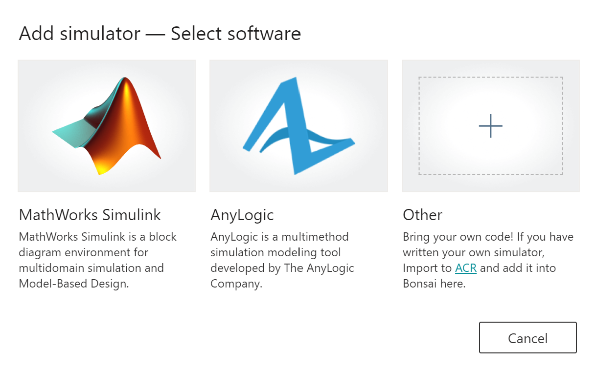
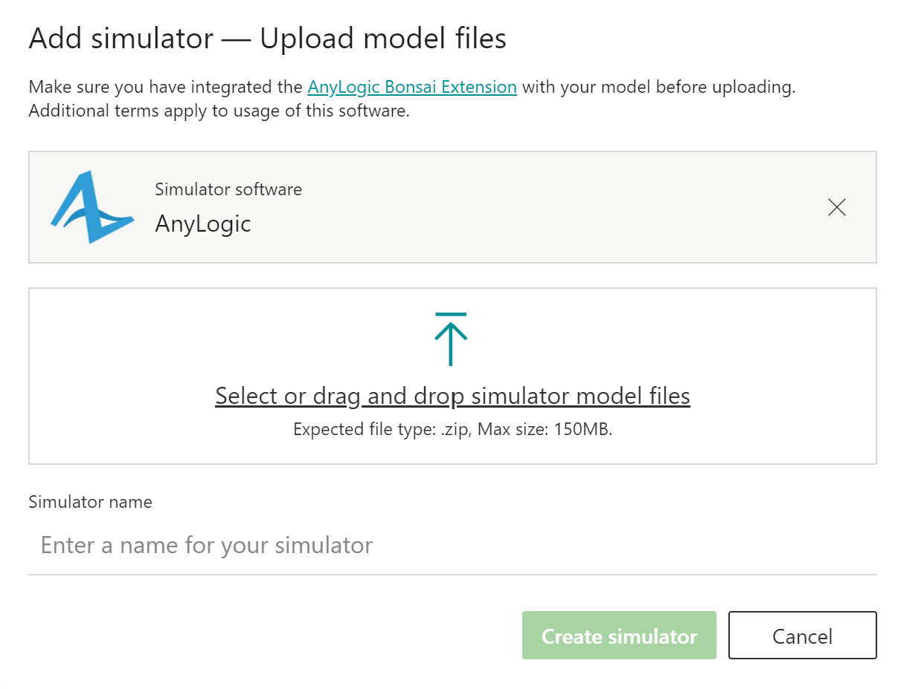
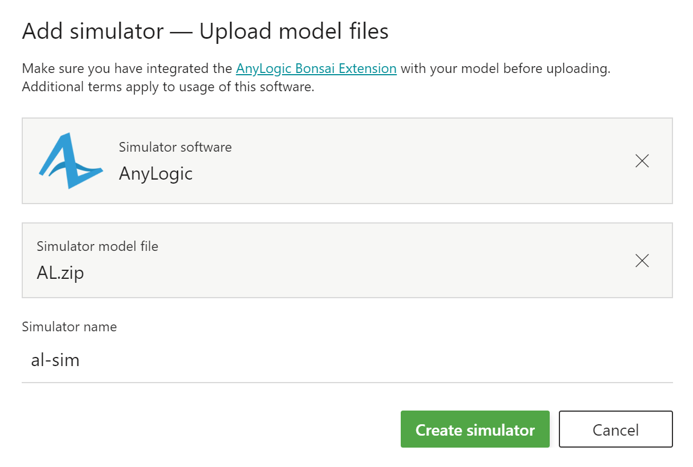

# Product Delivery Overview
This model simulates product delivery in USA. The supply chain includes three manufacturing facilities and fifteen distributors that order random amounts of the product – between 500 and 1000, uniformly distributed – each 1 to 2 days (uniformly distributed). There is a fleet of trucks in each manufacturing facility. When a manufacturing facility receives an order from a distributor, it checks the number of products in storage. If the required amount is available, it sends a loaded truck to the distributor. Otherwise, the order waits until the factory produces the sufficient number of products. Orders are queued in FIFO order.

### Complexity 
- The demand coming from each distribution center should be varied:
- Seasonal change 
- Sudden disruptions/surge in demand  

### Observation space
- Inventory level at each manufacturing location
- Number of trucks, number of idle vs busy trucks, utilization of fleet at each location
- Whether manufacturing facility is open or not
- Average waiting time for orders placed at each manufacturer
- Average waiting time for all manufacturing facilities   

### Action space
- Production rate of each facility
- Number of trucks in each facility
- If a facility should stay open or not

### Reward
- The reward is driven by minimizing the cost of average wait time across the system.

# Create a Brain

To start a new brain for this model: 

1. Create an account or sign into Bonsai. 
2. Click **Create brain** button in the top left, then select **Empty brain** in the dialog. 
3. Name your new brain (e.g., “product-delivery”). 
4. Click **Create Brain**. This will create a new brain for you.

Copy the contents of <a href="product_delivery.ink">product_delivery.ink</a> in to the *Teach* tab for your new brain. 

Do not click Train yet. 

# Running the Model

To run the model, right click on **AnimatedExperiment** then click the **Run** button. You will see text in the console about registering with the Bonsai platform. Once registration is complete (it will only take a few seconds), go back to the Bonsai dashboard where you created your brain.

Click the **Train** button. The simulator with the name matching your simulator will appear (in the example above, this is called *AnyLogic - ABCA*). Click the name of your simulator. 

If this is the first start of your brain it may take a few minutes for the brain to generate the appropriate parameters and connect to the simulator. Once the connection is made you will see your first episodeStart event fire in the ModelExecuter handler. 

You may decide to let your training run for a bit, particularly across multiple episode start events, to get an understanding of how the model behaves under various configuration parameters provided by the brain. You will also want to make sure your number of iterations stay below 1000, or the brain will struggle to learn. If needed, you can implement custom logic in the **halted()** method in ModelExecuter to help drive behavior. Halted indicates to the brain that the simulator has reached a state that it cannot progress from.

After you have tested locally, stop your model. Then click **Stop Training** in the Bonsai dashboard for the brain. 

# Export Your Model

After you have confirmed your model can connect to the platform locally, it's time to scale your model.

AnyLogic Professional users can export their model by going to **File** > **Export...** > **to standalone Java application** in the menu bar. 

Select **HeadlessExperiment** in the dialog and the directory where the exported files will reside.

If you need additional assistance with exporting a model, please see the <a href="https://help.anylogic.com/index.jsp?topic=%2Fcom.anylogic.help%2Fhtml%2Fstandalone%2FExport_Java_Application.html">Exporting a model as a standalone Java application</a> topic in the AnyLogic Help topics.

If you are not able to export your model to a standalone Java application you may use the example <a href="exported.zip">exported.zip</a> file to use for scaling.

# Scale Your Model

Once you have exported your model, you can zip the entire contents of the folder that contains the exported application. 

For example, if your folder structure is:

```
Product Delivery Exported
└─── lib
|    |── AnyLogic Model End User Agreement.pdf
|    └── ... jar files ...      
|─── Product Delivery_linux.sh
|─── ... jar files ...
└─── readme.txt
```

Then you only need to zip the parent **Product Delivery Exported** folder. 

Back in the Bonsai dashboard, next to **Simulators**, click the **Add sim** button.

This will open a dialog. 



Select AnyLogic. 



Select or drag the zip file containing the exported model. 



Give your simulator a name, then click **Create simulator**. 

After the simulator is created you will see the new simulator appear under the **Simulators** section.

Now click the *Teach* tab. 

In the simulator definition, just after the open brackets, add a package</a> statement using the name of the simulator you gave during the Add Simulator dialog above.

```
simulator Simulator(action: Action, config: SimConfig): SimState {
	package "<simulator_name>"
}
```

Now click **Train**. Since you indicated the package name you do not need to select a simulator from the dropdown like you did when you started locally.

In a few minutes time you will see several simulators connect to and train your brain.  

# Using Bonsai Assessment with Your Model
Starting an Assessment session is similar to starting a training session. Start your AnimatedExperiment class and wait for it to register. In the Bonsai UI, using your already-trained brain, click the **Assessment** button. Then select the name of your simulator.