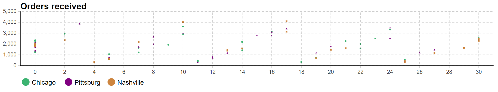

# Use case: Product Delivery

## Use case problem

### Problem description

The supply chain includes three manufacturing centers (Chicago, Nashville, Pittsburg) and fifteen distribution centers that order random amounts of the product. Each distribution center orders between 500 and 1000 products, uniformly distributed – every 2-10 days. This suggests that

- There is a minimum of two days between orders placed by the same distribution center
- There can be up to 15 orders placed per day by all distribution centers

There is a fleet of 3 trucks available at each manufacturing center to deliver the products to the distribution centers. When a manufacturing center receives an order from a distribution center, it checks the number of available products in storage.

If the requested amount of product is available and there are trucks available at the manufacturing center, it sends loaded trucks to the distribution center. Otherwise, the order waits until the factory produces the sufficient amount of products or there are trucks available. The orders are always sent to the closest manufacturing center and the shortage of product at any specific manufacturing center does not lead to a transfer of the order to another manufacturing center. Upon closure of one manufacturing center, its order will be transferred to the next closest manufacturing center.

Note that orders can be of varying sizes and only one order (regardless of its size) can be processed at the time and they are queued based on first-in-first-out.

### Terminology

The turnaround time is defined as the time it takes for the order to be received by the distribution center from the time the order has been placed.

T<em>order</em> : Time the order has been placed by the distribution center.

T<em>receipt</em> : Time the order has been received by the distribution center.

T<em>turnaround</em>  = T<em>receipt</em> - T<em>order</em>

For each manufacturing center, the cost consists of
- Truck costs: For every hour that the manufacturing center is open or has orders inside of it, the total truck cost is accumulated by number of vehicles * hourly truck cost.
- Open costs: For every hour that the manufacturing center is open, the total open cost is accumulated by the hourly open cost.
Production costs: For every hour that the manufacturing center is open or has orders inside of it, the total production cost is accumulated by the production rate - hourly production cost
- Incomplete costs: For every hour that there are orders in queue to be processed at the manufacturing center, the incomplete order cost is accumulated by the number of orders in the queue * the hourly incomplete order penalty

### Business problem

Fulfill the demands of all the distribution centers in shortest amount of time by minimizing the turnaround time while respecting the cost limits across various order distributions.

### Objective

Given a wide range of demands by distribution centers, demonstrate a BRAIN which can optimize for the turnaround time while also respecting the cost limits. This is acheived through the use of tools in hand that include the production rate at each manufacturing center, the number of trucks allocated to each manufacturing center, and whether to accept new orders at each manufacturing center or not.

### Benchmark

Use the AnyLogic Internal Optimizer as the benchmark performance.

## Problem simulation description

The model simulates delivery of products from three manufacturing center to fifteen distribution centers in USA written in AnyLogic. The orders can be of varying sizes thar are uniformly distributed between 500 and 1000 units, and can uniformly occur every 2 to 10 days. Once an order is received, the reinforcement learning agent will determine how to fulfill the order most time and cost effectively. Each manufacturing center produces product with a set rate given by the productionRate parameter inside the ManufacturingCenter agent type. If the manufacturing center that receives the order is open but doesn’t have enough in stock, the order will wait in a queue denoted by the ordersQueue block inside the ManufacturingCenter agent type until enough products are in the inventory to trigger the shipment. It is worth reminding that the shortage of product at any specific manufacturing center does not lead to a transfer of the order to another manufacturing center. The cost associated with different sections of a manufacturing center are as follows:

### Problem description

|                        | Definition                                                   | Notes |
| ---------------------- | ------------------------------------------------------------ | ----- |
| Objective              |  Meet the distribution center demands while minimizing the turnaround time and respecting the cost limit given a wide range of orders by the distribution centers | |
| Observations           |  Chicago_is_open, Pittsburg_is_open, Nashville_is_open, Chicago_num_trucks, Pittsburg_num_trucks, Nashville_num_trucks, Chicago_production_rate, Pittsburg_production_rate, Nashville_production_rate, Chicago_util_trucks, Pittsburg_util_trucks, Nashville_util_trucks, Chicago_inventory_level, Pittsburg_inventory_level, Nashville_inventory_level, Chicago_orders_queueing, Pittsburg_orders_queueing, Nashville_orders_queueing, Chicago_average_turnaround, Pittsburg_average_turnaround, Nashville_average_turnaround, Pittsburg_cost_per_product, Nashville_cost_per_product, overall_average_turnaround, overall_average_cost_per_product, time | |
| Actions                | Chicago_is_open, Pittsburg_is_open, Nashville_is_open, Chicago_num_trucks, Pittsburg_num_trucks, Nashville_num_trucks, Chicago_production_rate, Pittsburg_production_rate, Nashville_production_rate | |
| Control Frequency      | Every 3 days | |
| Episode configurations | OpenCost_PerHour, ProductionCost_PerHour, IncompleteOrderPenalty_PerHour, TruckCost_PerHour, FirstActionTime_Days, RecurrenceActionTime_Days, RollingWindowSize_Days | |
| Iteration              | Every 3 days | |
| Episode                | 30 days or 720 hours

* **MC_is_open** refers to whether manufacturing center accepts new orders or not.
* **MC_num_trucks** refers to the number of trucks allocated to the manufacturing center.
* **MC_production_rate** refers to the production rate at the manufacturing center.
* **MC_util_trucks** refers to the truck utilization rate at the manufacturing center.
* **MC_inventory_level** refers to the inventory level at the manufacturing center.
* **MC_orders_queueing** refers to the sum of all order sizes queueing at the manufacturing center.
* **MC_average_turnaround** refers to the average turnaround time at the manufacturing center
* **MC_cost_per_product** refers to the total accumulated cost at the manufacturing center.
* **overall_average_turnaround** refers to the average turnaround time for all the manufacturing centers.
* **overall_average_cost_per_product** refers to the average total accumulated cost for all the manufacturing centers.
* **time** refers to the time that has passed since the start of the episode.

## Solution approach

### High level solution architecture

The objective is to reduce the overall average turnaround time so brain receives higher reward when the turnaround time is lower. Moreover, the brain would further receive a higher reward when when truck utilization is higher. The episode is terminated when the overall cost per product across all manufacturing centers exceeds a certain threshold.

The reward and terminal functions are defined as

|                        | Definition                                                   |
| ---------------------- | ------------------------------------------------------------ | 
| Reward                 |  Shaping the reward based on overall_average_turnaround and MC_util_trucks  | |
| Terminal               |  if time > 720 or overall_average_cost_per_product > 100                    | |

